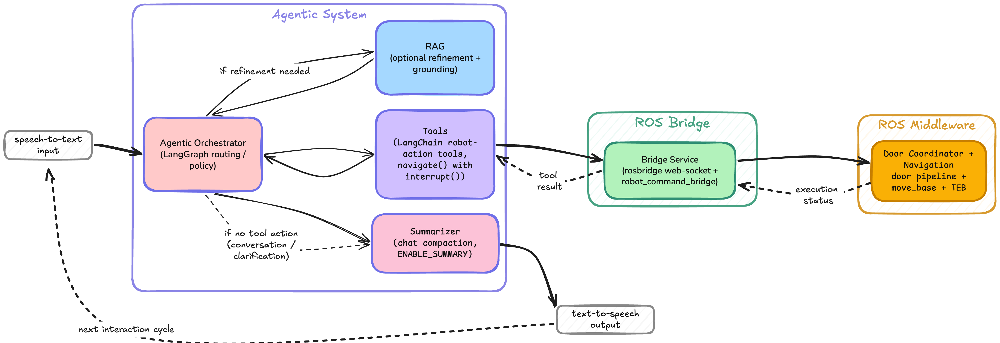
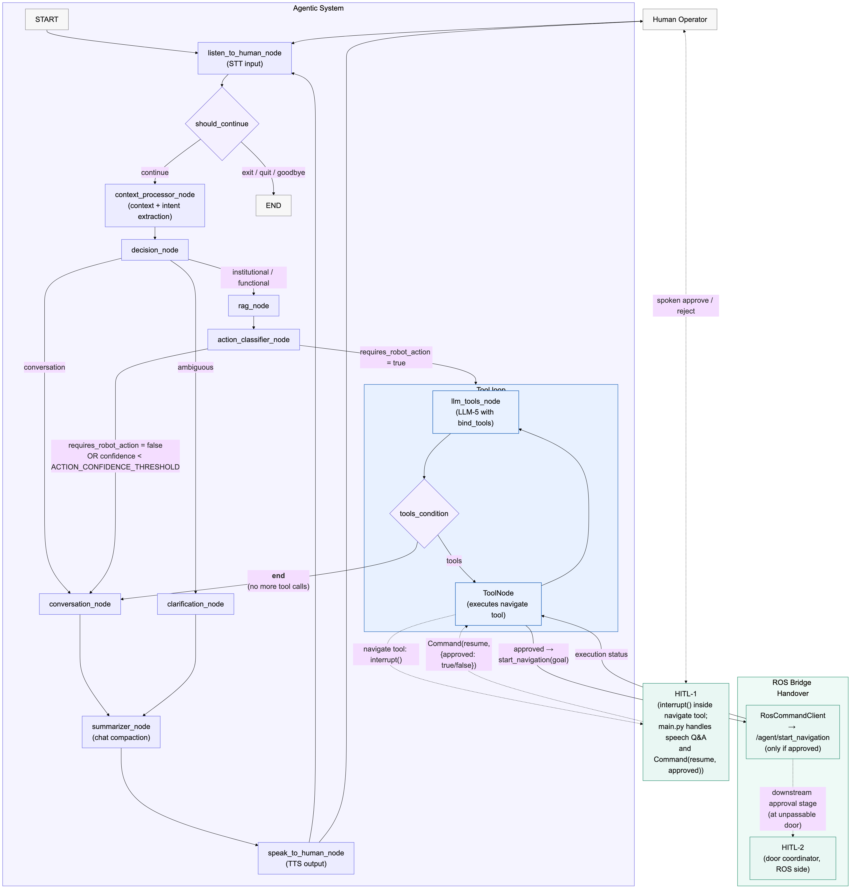
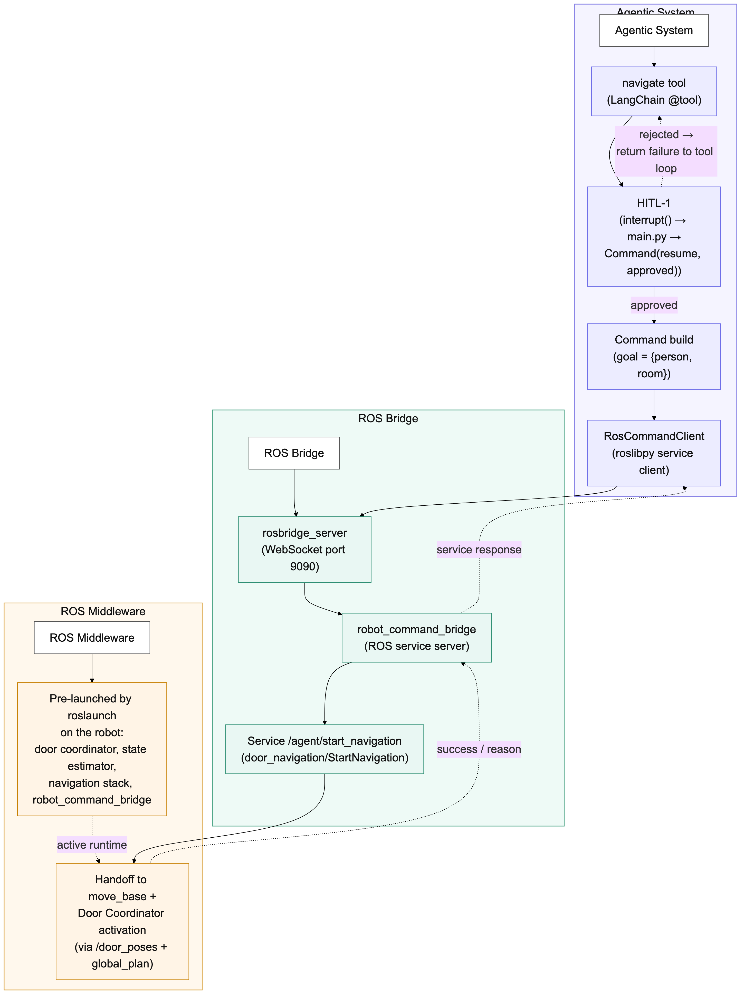

# robotdog_guide

Python 3.10 **LangGraph agent** that runs on the Jetson **outside ROS** and drives the Go1 by calling the `door_navigation` package's ROS services over **rosbridge**. It handles the human side of the guide use-case — listening, RAG-based knowledge answers, LLM-based intent classification, tool calls (navigate, etc.), human-in-the-loop confirmation, and speaking back.

Companion package on the ROS side: `[door_navigation](../catkin_ws/src/door_navigation/README.md)`.

## Architecture highlights

### End-to-end workflow

The guide connects speech input, the LangGraph agent, tool execution, rosbridge, and the downstream ROS navigation stack:



### Agent workflow through rosbridge

The detailed agent graph routes each interaction through context processing, intent classification, RAG or conversation handling, human approval, and tool execution:



The approved tool request is validated, packaged, and transported over the rosbridge WebSocket before execution feedback is returned to the agent:



---


## Short system overview

**Runtime flow of one turn**

1. `listen_to_human` calls `voiceAssistant.get_voice_input()` → routes to `/voice/listen` on the robot via `ros_client`.
2. `context_processor` (LLM-1) normalizes the utterance; `decision` picks one of `functional / institutional / ambiguous / conversation`.
3. Institutional / functional queries hit `rag_node` (LLM-3 + ChromaDB); functional queries then go through `action_classifier`. If confidence ≥ `ACTION_CONFIDENCE_THRESHOLD`, the LLM-with-tools node calls the appropriate tool (`navigate`, etc.).
4. `navigate` in `robot_dog_tools.py` uses `interrupt()` to ask for human approval, then calls `/agent/start_navigation` over rosbridge and returns the result to the LLM.
5. `summarizer_node` produces a short response; `speak_to_human` speaks it back through `/voice/speak`.
6. Loop back to listen.

**Main files and their roles**

- `main.py` — entry point, conversation loop, `interrupt`/resume handling.
- `src/graph/workflow.py` — LangGraph node/edge wiring.
- `src/graph/state.py`, `src/graph/schemas.py` — typed state + per-node output schemas.
- `src/nodes/` — one file per stage (`decision_nodes`, `rag_nodes`, `action_nodes`, `speech_process_nodes`, `feedback_nodes`).
- `src/tools_servers/robot_dog_tools.py` — the `@tool` functions the LLM can call (currently `navigate`; `stand_up`, `sit_down`, `emergency_stop` are stubs).
- `src/tools_servers/ros_client.py` — `RosCommandClient`: rosbridge wrapper for `/agent/start_navigation`, `/voice/speak`, `/voice/listen`.
- `src/rag_server/` — ChromaDB + embeddings + IAS scraper + `voiceAssistant.py` (now a thin alias for `RosCommandClient`).
- `src/config.py` — Ollama model choices per LLM stage, `ACTION_CONFIDENCE_THRESHOLD`.
- `src/rag_server/config.py` — RAG paths, Vosk model path, `NARRATE_NODES` flag.
- `src/logger.py` — writes `src/logs/robotdog_logger.log`.
- `requirements_unified.txt` — Python 3.10 deps (audio libs intentionally omitted, all audio goes through rosbridge now).

---


## Documentation index


| Doc                                                        | What it covers                                                                                          |
| ---------------------------------------------------------- | ------------------------------------------------------------------------------------------------------- |
| `[README.md](README.md)` *(this file)*                     | System overview, quick start, setup steps for the Jetson Py 3.10 venv, rosbridge, and Ollama.           |
| `[cmd_&_issues.txt](cmd_&_issues.txt)`                     | One-off fixes collected during setup (simpleaudio system deps, TLS / OpenMP env var, scikit-learn pin). |
| `[object_detection/readme.md](object_detection/readme.md)` | Standalone object-detection experiments (not part of the guide runtime).                                |
| `[models_reviews.txt](models_reviews.txt)`                 | Notes on candidate LLMs.                                                                                |


ROS-side docs (in `catkin_ws/src/door_navigation/`):


| Doc                                                                                         | What it covers                                                                                    |
| ------------------------------------------------------------------------------------------- | ------------------------------------------------------------------------------------------------- |
| `[door_navigation/README.md](../catkin_ws/src/door_navigation/README.md)`                   | ROS pipeline overview, coordinator + perception + voice node, `/agent/start_navigation` contract. |
| `[door_navigation/SETUP.md](../catkin_ws/src/door_navigation/SETUP.md)`                     | Catkin workspace, cv_bridge for Py 3.8, RealSense, TensorRT.                                      |
| `[door_navigation/internet_setup.md](../catkin_ws/src/door_navigation/internet_setup.md)`   | Jetson internet routing via IAS PC.                                                               |
| `[door_navigation/time_sync_setup.md](../catkin_ws/src/door_navigation/time_sync_setup.md)` | PC ↔ Jetson ↔ Go1 clock sync. Must be green before running the guide.                             |
| `[door_navigation/commands.md](../catkin_ws/src/door_navigation/commands.md)`               | Day-to-day cheatsheet (rosbridge launch, sanity checks).                                          |


---


## Setup (Jetson, Py 3.10 venv)

> **Do NOT use** `uv` **on the Jetson if you need GPU.** Jetson's Ollama/PyTorch stack relies on system-CUDA (JetPack) libs that `uv` isolates away. Use `uv` only for CPU-only bringup; for the real robot, install into a `venv --system-site-packages`.

1. **Clone and enter the repo**
  ```bash
   git clone https://github.com/Satya1998-debug/robotdog_guide.git
   cd robotdog_guide
  ```
2. **Install** `uv` (CPU-only bringup) or a native `venv` (Jetson with GPU):
  ```bash
   # CPU-only
   curl -LsSf https://astral.sh/uv/install.sh | sh
   uv pip install -r requirements_unified.txt

   # Jetson (GPU): use a system-site-packages venv
   python3.10 -m venv .venv --system-site-packages
   source .venv/bin/activate
   pip install -r requirements_unified.txt
  ```
3. **Regenerate** `requirements_unified.txt` after adding a package:
  ```bash
   uv pip list --format=freeze | cut -d'=' -f1 > requirements_unified.txt
  ```
4. **Freeze default Python (Jetson)** — JetPack ships Python 3.8; install 3.10 alongside and pin `.venv` to it (do not `apt remove` the system Python).


## Setup — ROS bridge (on the Jetson, outside both venvs)

The guide talks to ROS through `rosbridge_websocket`. Install it in the **global** ROS environment (system Python, not inside a venv):

```bash
sudo apt-get install ros-noetic-rosbridge-suite
sudo apt install python3-tornado python3-twisted
roslaunch rosbridge_server rosbridge_websocket.launch   # smoke test
```

If a venv is accidentally activated when launching rosbridge, the launcher will pick up the wrong Python — always deactivate first, or launch from a fresh terminal. See also `door_navigation/setup_issues_jetson_env.md` for the `python3-attr` reinstall fix if `attr.s` errors show up.

Reference tutorial: [https://wiki.ros.org/rosbridge_suite/Tutorials/RunningRosbridge](https://wiki.ros.org/rosbridge_suite/Tutorials/RunningRosbridge)

Inside the Py 3.10 guide venv, ensure the client is present:

```bash
pip install roslibpy   # already listed in requirements_unified.txt
```


## Setup — Ollama (LLM orchestration)

```bash
curl -fsSL https://ollama.com/install.sh | sh
ollama pull qwen2.5:7b-instruct       # LLM-1/2/3
ollama pull qwen2.5:3b-instruct       # LLM-5/6 (tools + summarizer)
# optional heavy planner:
ollama pull deepseek-r1:7b-qwen-distill-q4_K_M
```

Model selection per stage lives in `[src/config.py](src/config.py)`. `ollama_base_url` defaults to `http://localhost:11434`.

## Setup — Vosk / voice

Audio hardware access lives on the ROS side (`voice_assistant_node.py`); this process only needs the Vosk model **path config** correct in `[src/rag_server/config.py](src/rag_server/config.py)` *if* the ROS-side voice node reads from the same location. The guide itself no longer opens PyAudio.

---


## Quick start

Assumes `door_agent_bringup.launch` is already running on the ROS side (see [door_navigation quick start](../catkin_ws/src/door_navigation/README.md#quick-start)) and clocks are synced.

```bash
cd ~/satya/robotdog_guide
source .venv/bin/activate

# Point at the robot's rosbridge (default 0.0.0.0:9090)
# export ROSBRIDGE_HOST=192.168.123.147
# export ROSBRIDGE_PORT=9090 (default 9090)

python main.py
```

The graph will greet the user, listen, and start looping. Logs stream to console **and** `src/logs/robotdog_logger.log` (see `[src/logger.py](src/logger.py)`).

To regenerate the graph PNG for docs:

```bash
python -c "from main import main; main(generate_graph=True)"
# writes robotdog_graph10.png in the repo root
```

---

